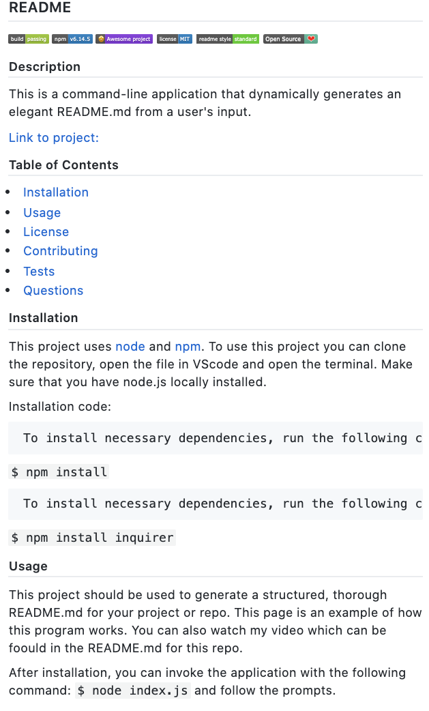

# My README Builder: A Fantastic README Generator!

## Description  

This command-line application dynamically generates an elegant,  structured README.md. The user will be prompted for their GitHub username and other information pertaining to the project the README is for.  Much like in life, you get out what you put in. This means that the more thoroughly the user answers the prompts in this app, the better their README.md will turn out!

An important thing to note is that having a screenshot is important to an appealing README.md. Please have a link handy for your screenshot when you answer the prompts or enter the filepath in the Repo where one is stored. This will render a classy final product.

Here is the live site: [myREADMEbuilder](https://erin-smith.github.io/myREADMEbuilder/)

    

## Installation

This application uses [node](https://nodejs.org/en/) and [npm](https://www.npmjs.com/) and will be invoked with the following command:

` $ node index.js`

To use this project you can clone the repository, open the file in VScode and open the terminal.  Make sure that you have node.js locally installed. 

Installation code:  

     To install necessary dependencies, run the following command:
  `$ npm install`  

     To install necessary dependencies, run the following command(s):  
`$ npm install inquirer`

Your README.md will be populated with the following:
***
* Repository title
* Badges
* Description with link to project
* Screenshot (if provided with link)
* Table of Contents
* Installation instruction with code line
* Usage
* License information with badge
* Contributing- an open invitation, list of contributore, and avatar icons of up to 7 contributors connected with your repository! Cool.
* Tests- info and space for command line
* Questions
 * With a Link to "issues" page so users can submit a new issue
 * User GitHub picture and link to profile
 * User GitHub email badge

## Usage

This vital resource allows a project creator to spend more time working on finishing the project and less time creating a good README! 

For more information, watch the walk-through video here:

## Tests 
  To run tests, run the following command:\
\`$ npm test\`\  

  I have tested this app extensively, you can see an example of a rendered final product here: 

## Questions:  
  

  If you have any questions about the repo, [open an issue](https://github.com/erin-smith/myREADMEbuilder/issues/new) or contact me:\  

* [My GitHub Profile](http://github.com/erin-smith)
* {](<"mailto:erin.acumen@gmail.com">)
***
`;
}

