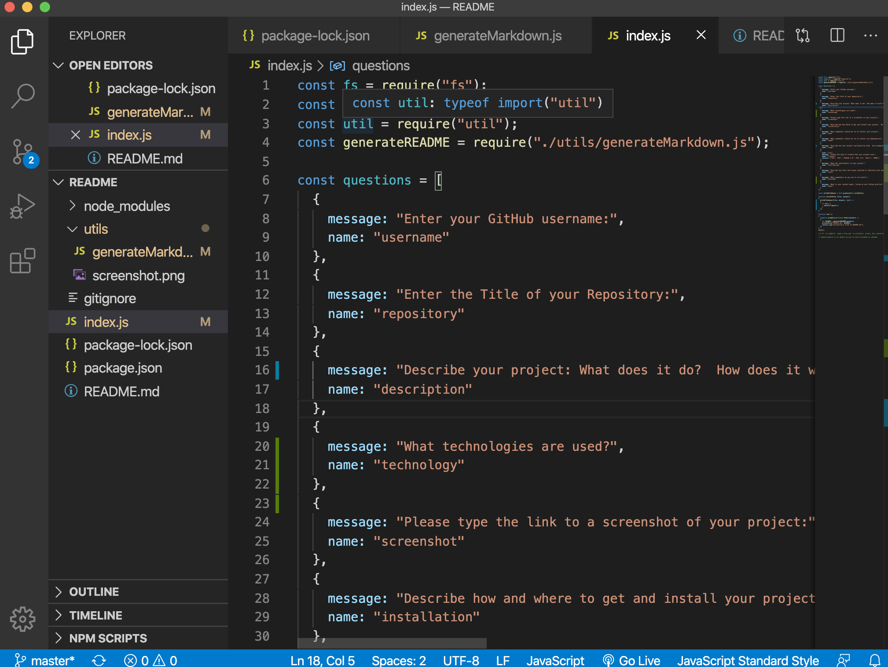

# myREADMEbuilder

## Description
  
[Link to project](https://erin-smith.github.io/myREADMEbuilder/)
  

## Table of Contents
* [Installation](#Installation)
* [Usage](#Usage)
* [License](#License)
* [Contributing](#Contributing)
* [Tests](#Tests)
* [Questions](#Questions)
 
 
## Installation 
   
To install the program, run the following command(s):`npm install`  

To install necessary dependencies, run the following command(s):  
`npm install inquirer`

## Usage 
  to make Fantastic README.md

## License 

  This project is licensed under the MIT license. 

## Contributing   
 If you would like to contribute to this project or have feedback, please contact me below in the Questions Section.
***
 **Contributors:** erin-smith   
***

 

## Tests 
  To run tests, run the following command:`npm test`  

  Also, used --inspector, made a lot of examples

## Questions:  
  

  If you have any questions about the repo, [open an issue](https://github.com/erin-smith/myREADMEbuilder/issues/new) or contact me:  

* [My GitHub Profile](http://github.com/erin-smith)
* 
***
